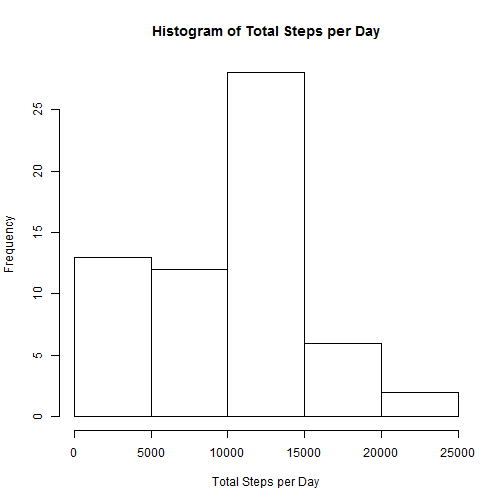

# Reproducible Research: Peer Assessment 1

================================================================================


## Loading and preprocessing the data

Step 1. Load the data.

The dataset is stored in a comma-separated-value (CSV) file and there are a total of 17,568 observations in this dataset. Using read.csv(). Missing values are coded as "NA".


```r
activity.df <- read.csv(file="activity.csv", header=TRUE, na.string="NA")
```


Step 2. Process/transform the data into a format suitable for analysis.

Convert the character representation of date to objects of class "Date".


```r
activity.df$date <- as.Date(activity.df$date)
```


## What is mean total number of steps taken per day?

For this part of the assignment, ignore the missing values in the dataset.

Step 1. Make a histogram of the total number of steps taken each day


```r
# Added up the total number of steps taken per day (ignoring any missing data)
total.steps.per.day.df <- aggregate(x=activity.df[ ,"steps"], by=list(activity.df$date), FUN=sum, na.rm=TRUE)
names(total.steps.per.day.df) <- c("date", "total.steps")

counts <- total.steps.per.day.df$total.steps
names(counts) <- as.character(total.steps.per.day.df$date)

barplot(counts, main="Distribution of total steps taken daily", xlab="Date")
```

 

```r
#png(filename="./figures/histogram_total_steps_w_missing_values.png")
#barplot(counts, main="Distribution of total steps taken daily", xlab="Date")
#dev.off()
```


Step 2. Calculate and report the mean and median total number of steps taken per day


```r
#ignoring any missing data
total.steps.per.day.mean <- mean(total.steps.per.day.df$total.steps, na.rm=TRUE)
total.steps.per.day.median <- median(total.steps.per.day.df$total.steps, na.rm=TRUE)
```

The mean total number of steps taken per day:

```r
print(total.steps.per.day.mean)
```

```
## [1] 9354
```

The median total number of steps taken per day:

```r
print(total.steps.per.day.median)
```

```
## [1] 10395
```


## What is the average daily activity pattern?

Step 1. Make a time series plot (i.e. type = "l") of the 5-minute interval (x-axis) and the average number of steps taken, averaged across all days (y-axis)


```r
# find average steps taken per 5-minute interval (ignoring missing data)
average.steps.per.interval.df <- aggregate(x=activity.df[ ,"steps"], by=list(activity.df$interval), FUN=mean, na.rm=TRUE)
names(average.steps.per.interval.df) <- c("interval", "average.steps")

plot(x=average.steps.per.interval.df$interval, y=average.steps.per.interval.df$average.steps, type="l", xlab="5-Minute Interval", ylab="Average Number Steps Taken", main="Average Daily Activity")
```

 

```r
#png(filename="./figures/plot_average_daily_activity.png")
#plot(x=average.steps.per.interval.df$interval, y=average.steps.per.interval.df$average.steps, type="l", xlab="5-Minute Interval", ylab="Average Number Steps Taken", main="Average Daily Activity")
#dev.off()
```


Step 2. Which 5-minute interval, on average across all the days in the dataset, contains the maximum number of steps?


```r
# determine maximum of average steps across all intervals
max.average.steps.per.interval <- max(average.steps.per.interval.df$average.steps)

# determine which interval containing the max average
max.idx <- which.max(average.steps.per.interval.df$average.steps)
interval.w.max.avg.steps <- average.steps.per.interval.df$interval[max.idx]

print(interval.w.max.avg.steps)
```

```
## [1] 835
```


## Imputing missing values

Note that there are a number of days/intervals where there are missing values (coded as NA). The presence of missing days may introduce bias into some calculations or summaries of the data.

Step 1. Calculate and report the total number of missing values in the dataset (i.e. the total number of rows with NAs)


```r
cases.ok <- complete.cases(activity.df)
num.cases.ok <- sum(cases.ok)
num.cases.not.ok <- length(cases.ok) - num.cases.ok

print(num.cases.not.ok)
```

```
## [1] 2304
```


Step 2. Devise a strategy for filling in all of the missing values in the dataset. The strategy does not need to be sophisticated. For example, you could use the mean/median for that day, or the mean for that 5-minute interval, etc.

We will impute missing values with the median number of steps across a 5-minute interval.


```r
# find the median steps taken per 5-minute interval (ignoring missing data)
median.steps.per.interval.df <- aggregate(x=activity.df[ ,"steps"], by=list(activity.df$interval), FUN=median, na.rm=TRUE)
names(median.steps.per.interval.df) <- c("interval", "median.steps")
row.names(median.steps.per.interval.df) <- as.character(median.steps.per.interval.df$interval)
```


Step 3. Create a new dataset that is equal to the original dataset but with the missing data filled in.


```r
# find the indexs of the missing rows
cases.not.ok.idxs <- which(!cases.ok)

# replace the missing data with the median values per 5-minute interval
for (k in 1:length(cases.not.ok.idxs)) {
  row.idx <- cases.not.ok.idxs[k]
  interval.of.missing.value <- activity.df[row.idx, "interval"]
  replacement.value <- median.steps.per.interval.df[as.character(interval.of.missing.value), "median.steps"]
  activity.df[row.idx, "steps"] <- replacement.value
}
```


Step 4. Make a histogram of the total number of steps taken each day. Calculate and report the mean and median total number of steps taken per day.


```r
total.steps.per.day.df <- aggregate(x=activity.df[ ,"steps"], by=list(activity.df$date), FUN=sum, na.rm=FALSE)
names(total.steps.per.day.df) <- c("date", "total.steps")

counts <- total.steps.per.day.df$total.steps
names(counts) <- as.character(total.steps.per.day.df$date)

barplot(counts, main="Distribution of total steps taken daily", xlab="Date")
```

 

```r
#png(filename="./figures/histogram_total_steps_w_imputed_values.png")
#barplot(counts, main="Distribution of total steps taken daily", xlab="Date")
#dev.off()
```


```r
# assuming no missing data
total.steps.per.day.mean <- mean(total.steps.per.day.df$total.steps, na.rm=FALSE)
total.steps.per.day.median <- median(total.steps.per.day.df$total.steps, na.rm=FALSE)
```

The mean total number of steps taken per day:

```r
print(total.steps.per.day.mean)
```

```
## [1] 9504
```

The median total number of steps taken per day:

```r
print(total.steps.per.day.median)
```

```
## [1] 10395
```


- Do these values differ from the estimates from the first part of the assignment?
ANSWER: YES for the mean value, NO for the median value.

- What is the impact of imputing missing data on the estimates of the total daily number of steps?
ANSWER: The mean value of the total steps taken per day increased with imputed data (from 9354 to 9504).  The median value stayed the same (10,395).


## Are there differences in activity patterns between weekdays and weekends?

For this part the weekdays() function may be of some help here. Use the dataset with the filled-in missing values for this part.

Step 1. Create a new factor variable in the dataset with two levels - "weekday" or "weekend" - indicating whether a given date is a weekday or weekend day.


```r
# obtain the days of the week for each calandar date (e.g., "Monday", "Tuesday", etc.)
days <- weekdays(activity.df$date)

# utility function to convert days of the week to "weekday" or "weekend"
weekday.weekend.conversion <- function (day.of.the.week) {
  if (day.of.the.week %in% c("Saturday", "Sunday")) {
    result <- "weekend"
  } else {
    result <- "weekday"
  }
  return(result)
}

# create a new factor variable with two levels - "weekday" or "weekend"
type.of.day <- factor(sapply(days, weekday.weekend.conversion), levels=c("weekday", "weekend"))

# add type.of.day factor variable as new column to data set
activity.df <- cbind(activity.df, type.of.day)
```


Step 2. Make a panel plot containing a time series plot (i.e. type = "l") of the 5-minute interval (x-axis) and the average number of steps taken, averaged across all weekday days or weekend days (y-axis).


```r
mean.steps.per.interval.df <- aggregate(x=activity.df[ ,"steps"], by=list(activity.df$interval, activity.df$type.of.day), FUN=mean, na.rm=FALSE)

names(mean.steps.per.interval.df) <- c("interval", "type.of.day", "mean.steps")


library(lattice)
xyplot(mean.steps ~ interval | type.of.day, data=mean.steps.per.interval.df, layout=c(1,2), type="l")
```

 

```r
#png(filename="./figures/plot_average_daily_activity_weekend_weekday.png")
#xyplot(mean.steps ~ interval | type.of.day, data=mean.steps.per.interval.df, layout=c(1,2), type="l")
#dev.off()
```


